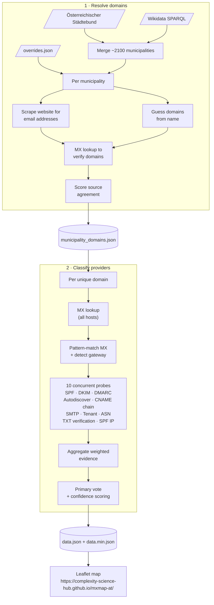

# MXmap — municipal email infrastructure maps

Interactive maps showing where Austrian municipalities host their email and how deeply their DNS is tied to US hyperscalers (Microsoft, Google, AWS) versus Austrian providers and self-hosted solutions.

**[View the maps](https://complexity-science-hub.github.io/mxmap-at/)**

[](https://complexity-science-hub.github.io/mxmap-at/)

## How it works

The data pipeline has two stages:

1. **Resolve domains** — Scrapes all ~2100 Austrian municipalities from the Österreichischer Städtebund
and extends it with Wikidata. Applies manual overrides, scrapes municipal websites for email addresses,
guesses domains from municipality names, and verifies candidates with MX lookups. Scores source agreement
to pick the best domain. Outputs `municipality_domains.json`.

2. **Classify providers** — For each resolved domain, looks up all MX hosts, pattern-matches them, then runs
10 concurrent probes (SPF, DKIM, DMARC, Autodiscover, CNAME chain, SMTP banner, Tenant, ASN, TXT verification,
SPF IP). Aggregates weighted evidence, computes confidence scores (0–100). Outputs `data.json` (full) and
`data.min.json` (minified for the frontend).



## Classification system

see [`classifier.py`](src/mail_sovereignty/classifier.py) for the full implementation details, but in summary,
we use a weighted evidence system where each probe contributes signals of varying strength towards different provider classifications.


## Quick start

```bash
uv sync

# Extract Austrian municipalities from Städtebund
uv run extract-austria-municipalities

# Stage 1: resolve municipality domains
uv run resolve-domains

# Stage 2: classify email providers
uv run classify-providers

# Optional: analyze results
uv run analyze

# Serve the map locally
python -m http.server
```

## Development

```bash
uv sync --group dev

# Run tests (90% coverage threshold enforced)
uv run pytest --cov --cov-report=term-missing

# Lint & format
uv run ruff check src tests
uv run ruff format src tests
```


## Related work

See the original project: https://github.com/davidhuser/mxmap

## Licence

[MIT](LICENCE)
